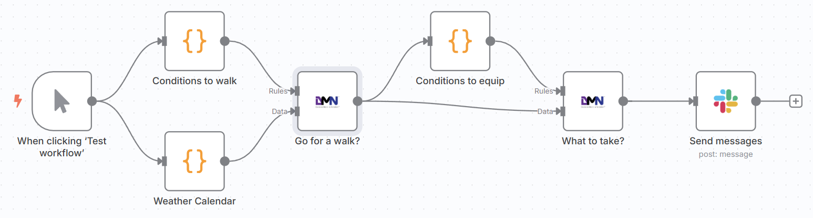

# n8n-nodes-dmn



This is an n8n community node that allows you to use [Decision Model and Notation (DMN)](https://www.omg.org/dmn/) tables within your [n8n](https://n8n.io/) workflows.

This node dynamically constructs and evaluates DMN 1.1 decision tables based on rules and data provided as inputs, leveraging the S-FEEL expression language subset supported by the underlying evaluation engine.

- DMN is an OMG standard for modeling and executing operational decisions.
- n8n is a [fair-code licensed](https://docs.n8n.io/reference/license/) workflow automation platform.

## Installation

Follow the [installation guide](https://docs.n8n.io/integrations/community-nodes/installation/) in the n8n community nodes documentation.

## Operation: Evaluate Decision

Executes a dynamically generated DMN decision table against input data.

- **Inputs:**
    1. `Rules`: An array of n8n items, where each item's JSON represents a single rule (row) in the decision table.
    2. `Data`: An array of n8n items, where each item's JSON represents the input context data to be evaluated against the rules.
- **Output:** Returns the decision result(s) merged with the original input data item, formatted according to the selected "Output Format" property.

## Configuration

The node requires configuration through its properties:

- **Input Parameters**: Define the input columns used in the decision table and their data types. The names must match keys in the input `Data` items.
  - Supported Types: `String`, `Number`, `Boolean`.
- **Output Parameters**: Define the output columns produced by the decision table and their data types.
  - Supported Types: `String`, `Number`, `Boolean`.
- **Hit Policy**: Select the DMN hit policy to determine how multiple matching rules are handled.
  - Supported Policies: `UNIQUE`, `FIRST`, `RULE ORDER`, `COLLECT`.
- **Output Format**: Choose how the results are structured in the output items.
  - Formats: Row with all hits (always lists), Row with all hits (single items and lists), Row for each hit, JSON with Output.

### S-FEEL Expressions

Input and output entries within the `Rules` data can utilize expressions based on the S-FEEL standard, as implemented by the underlying evaluation library. This includes:

- Comparisons (`<`, `>`, `<=`, `>=`)
- Ranges (`[1..10]`, `(1..10)`)
- Disjunctions (comma-separated lists like `"a", "b"`, or `10, 20`)
- Negation (`not(...)` - *Note: For string negation, use `<> "string"` syntax in your rule input*)
- Simple string literals (`"go"`, `"stay home"`)
- Numeric and boolean literals (`10`, `true`)
- The hyphen (`-`) for wildcard inputs.

Refer to the underlying library documentation for more specific S-FEEL details. Not all the features are 100% operational, so test your solution properly.

## Resources

- [n8n community nodes documentation](https://docs.n8n.io/integrations/community-nodes/)
- [OMG Decision Model and Notation (DMN) Specification v1.1](https://www.omg.org/spec/DMN/1.1/PDF)
- [dmn-eval-js Library (underlying engine)](https://github.com/HBTGmbH/dmn-eval-js)

## Attribution

- This node leverages the [dmn-eval-js](https://github.com/HBTGmbH/dmn-eval-js) library by Andre Hegerath.
- It is also based on the n8n community [Nodes Starter template](https://github.com/n8n-io/n8n-nodes-starter).

## Disclaimer

Dynamically generating and evaluating DMN based on user inputs can be complex. While this node aims to support common use cases, edge cases or specific S-FEEL constructs might lead to unexpected behavior or parsing errors in the underlying library. Please test thoroughly and report any issues.

## Prerequisites

You need the following installed on your development machine:

1. Set up [git](https://git-scm.com/downloads)
2. Node.js and npm. Minimum version Node 18. You can find instructions on how to install both using nvm (Node Version Manager) for Linux, Mac, and WSL [here](https://github.com/nvm-sh/nvm). For Windows users, refer to Microsoft's guide to [Install NodeJS on Windows](https://docs.microsoft.com/en-us/windows/dev-environment/javascript/nodejs-on-windows).
3. Install n8n with:

  ```#!/bin/bash
  npm install n8n -g
  ```
4. Import the lib from the settings panel

  Recommended: follow n8n's guide to [set up your development environment](https://docs.n8n.io/integrations/creating-nodes/build/node-development-environment/).

## License

[MIT](https://github.com/n8n-io/n8n-nodes-starter/blob/master/LICENSE.md)
